# UML Class Diagram - Examination System

```mermaid
classDiagram
    %% Interfaces
    class IComparable~T~ {
        <<interface>>
        +CompareTo(T other) int
    }
    
    class ICloneable {
        <<interface>>
        +Clone() object
    }

    %% Enums and Delegates
    class ExamMode {
        <<enumeration>>
        Starting
        Queued
        Finished
    }

    class ExamStartedHandler {
        <<delegate>>
        void(object sender, ExamEventArgs e)
    }

    %% Answer Classes
    class Answer {
        +int Id
        +string Text
        +Answer(int id, string text)
        +Answer(string text)
        +Answer(List~Answer~ answers)
        +ToString() string
        +Equals(object obj) bool
        +GetHashCode() int
        +CompareTo(Answer other) int
    }

    class AnswerList {
        +List~Answer~ Answers
        +AnswerList()
        +AnswerList(List~Answer~ answers)
        +AnswerList(int size)
        +Add(Answer answer) void
        +GetById(int id) Answer
        +this[int index] Answer
        +ToString() string
    }

    %% Question Hierarchy
    class Question {
        <<abstract>>
        +string Header
        +string Body
        +int Marks
        +AnswerList Answers
        +Answer CorrectAnswer
        +Question(string header, string body, int marks, AnswerList answers, Answer correctanswer)
        +Display()* void
        +CheckAnswer(Answer studentAnswer)* bool
        +ToString() string
        +Equals(object obj) bool
        +GetHashCode() int
    }

    class ChooseOneQuestion {
        +ChooseOneQuestion(string header, string body, int marks, AnswerList answers, Answer correctanswer)
        +CheckAnswer(Answer studentAnswer) bool
        +Display() void
    }

    class ChooseAllQuestion {
        +ChooseAllQuestion(string header, string body, int marks, AnswerList answers, Answer correctanswer)
        +CheckAnswer(Answer studentAnswer) bool
        +Display() void
    }

    class TrueFalseQuestion {
        +TrueFalseQuestion(string header, string body, int marks, AnswerList answers, Answer correctanswer)
        +CheckAnswer(Answer studentAnswer) bool
        +Display() void
    }

    class QuestionList {
        +string FileName
        +QuestionList()
        +QuestionList(string fileName)
        +Add(Question question) void
        +ToArray() Question[]
    }

    %% Exam Hierarchy
    class Exam {
        <<abstract>>
        +event ExamStartedHandler ExamStarted
        +int Time
        +int NumberOfQuestions
        +List~Question~ Questions
        +Dictionary~Question, Answer~ QuestionAnswerDictionary
        -Subject Subject
        +ExamMode Mode
        +int TotalStudentMarks
        +int TotalExamMarks
        +string ResultsFile
        +Exam(int time, int numberOfQuestions, List~Question~ questions, Subject subject, ExamMode mode)
        +ShowExam()* void
        +Start() void
        +Finish() void
        +CorrectExam() void
        +ToString() string
        +Equals(object obj) bool
        +GetHashCode() int
        +CompareTo(Exam other) int
        +Clone() object
    }

    class PracticeExam {
        +PracticeExam(int time, int numberOfQuestions, List~Question~ questions, Subject subject, ExamMode mode)
        +ShowExam() void
        +Start() void
        +Finish() void
    }

    class FinalExam {
        +FinalExam(int time, int numberOfQuestions, List~Question~ questions, Subject subject, ExamMode mode)
        +ShowExam() void
        +Start() void
        +Finish() void
    }

    %% Event Args
    class ExamEventArgs {
        +Subject Subject
        +Exam Exam
    }

    %% Student and Subject
    class Student {
        +string Name
        +int Id
        +Student(string name, int id)
        +OnExamStarted(object sender, ExamEventArgs e) void
        +ToString() string
    }

    class Subject {
        +string Name
        +List~Student~ Students
        +Subject()
        +Subject(string name)
        +Subject(string name, List~Student~ students)
        +Enroll(Student student) void
        +NotifyStudents(object sender, ExamEventArgs e) void
    }

    %% Repository
    class Repository~T~ {
        +T[] values
        +int capacity
        +int count
        +Repository()
        +Repository(T[] values)
        +Add(T item) void
        +Remove(T item) void
        +RemoveAt(int index) void
        +Sort() void
        +GetAll() void
        +Clone() object
        +CompareTo(object obj) int
        +this[int index] T
    }

    class List~T~ {
        <<external>>
    }

    class EventArgs {
        <<external>>
    }

    %% Relationships - Inheritance
    Question <|-- ChooseOneQuestion
    Question <|-- ChooseAllQuestion
    Question <|-- TrueFalseQuestion
    Exam <|-- PracticeExam
    Exam <|-- FinalExam
    List~Question~ <|-- QuestionList
    EventArgs <|-- ExamEventArgs

    %% Relationships - Implementation
    Answer ..|> IComparable~Answer~
    Exam ..|> IComparable~Exam~
    Exam ..|> ICloneable

    %% Relationships - Composition/Aggregation
    Question *-- AnswerList : contains
    Question *-- Answer : has correct answer
    AnswerList *-- Answer : contains list
    Exam *-- Question : contains list
    Exam *-- Answer : maps to
    Exam *-- Subject : associated with
    Exam *-- ExamMode : has mode
    Subject *-- Student : contains list
    QuestionList *-- Question : contains list
    ExamEventArgs *-- Subject : references
    ExamEventArgs *-- Exam : references

    %% Relationships - Dependencies
    Exam ..> ExamStartedHandler : uses
    Exam ..> ExamEventArgs : creates
    Subject ..> ExamEventArgs : receives
    Student ..> ExamEventArgs : receives
    Repository~T~ ..> ICloneable : constraint
    Repository~T~ ..> IComparable~T~ : constraint
```

## Diagram Legend

### Symbols Used:
- `<<abstract>>` - Abstract class
- `<<interface>>` - Interface
- `<<enumeration>>` - Enum
- `<<delegate>>` - Delegate
- `<<external>>` - External .NET class
- `*` after method name - Abstract method
- `<|--` - Inheritance (is-a)
- `..|>` - Interface implementation
- `*--` - Composition (has-a, strong)
- `o--` - Aggregation (has-a, weak)
- `..>` - Dependency (uses)

## Key Relationships:

### Inheritance Hierarchy:
1. **Question Hierarchy**: 
   - Question (abstract) → ChooseOneQuestion, ChooseAllQuestion, TrueFalseQuestion

2. **Exam Hierarchy**: 
   - Exam (abstract) → PracticeExam, FinalExam

3. **List Extension**: 
   - List<Question> → QuestionList

4. **EventArgs Extension**: 
   - EventArgs → ExamEventArgs

### Interface Implementations:
- Answer implements IComparable<Answer>
- Exam implements IComparable<Exam> and ICloneable

### Associations:
- **Exam** has many **Questions**
- **Exam** maps **Questions** to student **Answers**
- **Exam** is associated with a **Subject**
- **Subject** contains many **Students**
- **Question** contains an **AnswerList** and a correct **Answer**
- **AnswerList** contains multiple **Answers**

### Event System:
- **Exam** raises **ExamStarted** event (ExamStartedHandler delegate)
- **ExamEventArgs** carries event data (Subject and Exam references)
- **Subject** subscribes to exam events and notifies enrolled **Students**

### Generic Repository:
- **Repository<T>** is a generic class with constraints requiring T to implement both ICloneable and IComparable<T>
- Can store and manage collections of any type meeting these constraints (e.g., Exam)

## Design Patterns Used:

1. **Template Method Pattern**: Exam class defines the algorithm structure (Start, Finish) with abstract methods (ShowExam) for subclasses
2. **Repository Pattern**: Generic Repository<T> for data storage and retrieval
3. **Event-Driven Architecture**: ExamStarted event with custom EventArgs
4. **Inheritance and Polymorphism**: Question and Exam hierarchies
5. **Collection Wrapper**: AnswerList and QuestionList wrap standard collections with custom behavior
